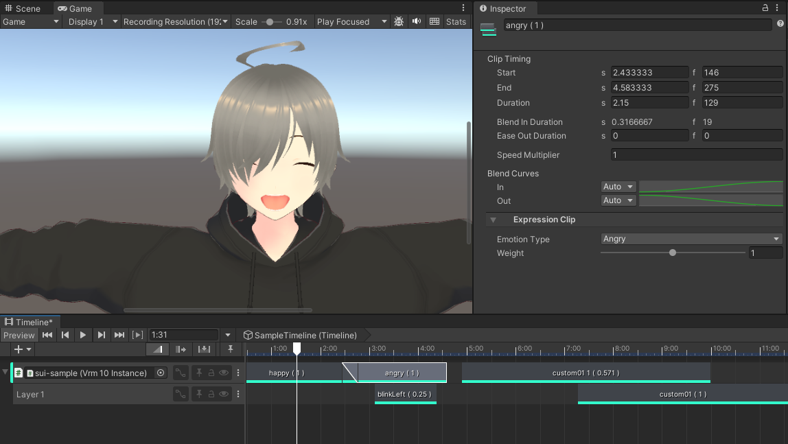

# Custom VRM1.0 Expression Track for Unity Timeline

## Overview

The Custom VRM1.0 Expression Track for Unity Timeline enhances facial animation capabilities in Unity by providing advanced support for the inherent features of VRM1.0 expressions. This custom track allows for blending, use of custom clips, and configuring multiple layers to maximize the expressive potential of VRM characters.



## Features

### Blending

- **Seamless Integration**: Blend multiple facial expressions to achieve realistic and nuanced animations.
- **Dynamic Control**: Adjust expression intensity and transitions to match scene requirements.

### Custom Clips

- **Full Utilization of VRM Features**: Custom clips are designed to harness the existing features of VRM expressions, ensuring that all predefined capabilities are available and perform optimally in custom scenarios.
- **Tailored Expressions**: Create and apply custom animations that are perfectly aligned with your VRM character's emotions and dialogue.

### Multi-Layer Configuration

- **Complex Animations**: Layer multiple expressions and animations to add depth and complexity to your character's expressions.
- **Enhanced Flexibility**: Manage individual layers for precise adjustments and control over each aspect of the facial expressions.


## Getting Started

### Install from git URL

You can install this package directly using Unity's Package Manager. Simply go to **Add package from git URL...** and enter the following URL:

```
https://github.com/sui4/VRMExpressionExtensionForUnity.git
```

To specify a particular tag or branch, append `#{tag,branch}` to the URL like so:

```
https://github.com/sui4/VRMExpressionExtensionForUnity.git#{tag,branch}
```

### Local Installation After Download

1. Download the `VRMExpressionExtensionForUnity` repository as a git clone or as a ZIP file to a folder of your choice.
2. In Unity, open the Package Manager and select **Add package from disk...**.
3. Navigate to the downloaded folder and select the `package.json` file to install the package.

Using a Git Submodule can simplify version control.
